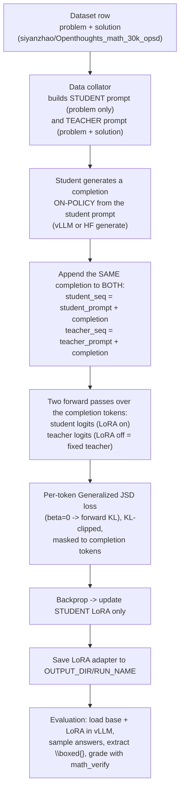

# OPSD on a Single Colab GPU — On-Policy Self-Distillation (Adapted)

> **This repository is an adaptation of the original OPSD codebase**
> ([*Self-Distilled Reasoner: On-Policy Self-Distillation for Large Language Models*](https://arxiv.org/pdf/2601.18734v3),
> [blog](https://siyan-zhao.github.io/blog/2026/opsd/)). The original targets **4–8×H100** with vLLM,
> FlashAttention-2, and DeepSpeed ZeRO-2. This fork keeps the **exact training/eval method** but adds
> **single-GPU Google Colab notebooks** and documents the pipeline end-to-end so it can be run and
> understood on modest hardware (e.g. one T4/L4/A100). All credit for the method and original
> implementation goes to the original authors (citation at the bottom).

---

## 1. What OPSD is, intuitively

A model learns to reason better **by teaching itself**. The *same* model plays two roles:

- **Student** — sees only the problem and writes a solution (this is what we want to improve).
- **Teacher** — sees the problem **plus a reference solution**, so it "knows the answer" and can judge
  what the next token *should* look like.

Training makes the student's next-token distribution match the teacher's, **along the student's own
generated text** (that's the "on-policy" part). The teacher never hands over the answer text; it only
provides a better probability distribution to imitate. The student internalizes the teacher's
hindsight-informed reasoning without ever being allowed to copy the reference solution.

Two design choices from the paper that this fork uses by default:

- **Fixed teacher** (`--fixed_teacher`): the teacher is the *initial* policy (the base model with LoRA
  adapters disabled). Only the student's LoRA adapters update. This is stable and memory-cheap.
- **Per-token KL clipping** (`--jsd_token_clip`): style tokens like "wait"/"hmm" can have 6–15× higher
  divergence than math tokens and dominate the loss; clipping each token's loss stabilizes training.

---

## 2. What this adaptation changes

| Aspect | Original repo | This fork |
|---|---|---|
| Hardware | 4–8×H100 | **1 GPU** (Colab T4/L4/A100) |
| Launcher | `accelerate` + DeepSpeed ZeRO-2 | **plain `python`** |
| Notebooks | — | **`colab_lightweight_train copy.ipynb`** (train), **`colab_lightweight_eval.ipynb`** (eval) |
| Generation | vLLM colocate | vLLM colocate (A100) or HF `generate` (small GPUs) |
| Scale | Qwen3-1.7B/4B/8B, ~100 steps | Qwen3-0.6B/1.7B, short runs (smoke-test → ~50 steps) |

The training **algorithm, prompts, loss, and evaluation code are unchanged** — only the orchestration
and scale differ. The notebooks call the same `opsd_train.py` / `eval/evaluate_math.py` entry points.

---

## 3. Repository structure

```
├── opsd_train.py                    # OPSD training entry point (arg parsing, model/dataset setup)
├── opsd_trainer.py                  # OPSDTrainer: on-policy generation + teacher scoring + JSD loss
├── data_collator.py                 # Builds the student & teacher prompts from each dataset row
├── sft_train.py / grpo_train.py     # SFT and GRPO baselines
├── accelerate.yaml                  # Multi-GPU config (for the original multi-GPU workflow)
├── scripts/                         # Original full-scale launch scripts (run_opsd_*.sh, run_eval*.sh)
├── eval/
│   ├── evaluate_math.py             # vLLM + LoRA evaluation (boxed-answer grading via math_verify)
│   └── run_eval.sh / run_eval_nonthink.sh
├── colab_lightweight_train copy.ipynb   # [this fork] single-GPU training notebook
└── colab_lightweight_eval.ipynb         # [this fork] single-GPU evaluation notebook
```

---

## 4. End-to-end pipeline at a glance



---

## 5. Example — how the student and teacher prompts are fed into training

Source: `data_collator.py` (default, non-`reason_first` path) using the dataset's `problem` and
`solution` fields. Suppose a row is:

- **problem:** `If 3x + 7 = 22, what is the value of x?`
- **solution:** `3x + 7 = 22 → 3x = 15 → x = 5. The answer is \boxed{5}.`

### 5a. Student prompt (sees ONLY the problem)

The collator builds this user message and applies the Qwen3 chat template with
`enable_thinking=False` (our non-thinking runs):

```text
Problem: If 3x + 7 = 22, what is the value of x?

Please reason step by step, and put your final answer within \boxed{}.
```

Rendered with the chat template it becomes (Qwen3 special tokens shown; non-thinking adds an empty
think block):

```text
<|im_start|>user
Problem: If 3x + 7 = 22, what is the value of x?

Please reason step by step, and put your final answer within \boxed{}.<|im_end|>
<|im_start|>assistant
<think>

</think>

```

The student then **generates a completion on-policy** from this prompt, e.g.:

```text
Subtract 7: 3x = 15. Divide by 3: x = 5. So \boxed{5}.
```

### 5b. Teacher prompt (sees problem + reference solution + a "use your own words" transition)

```text
Problem: If 3x + 7 = 22, what is the value of x?

Here is a reference solution to this problem:
=== Reference Solution Begin ===
3x + 7 = 22 → 3x = 15 → x = 5. The answer is \boxed{5}.
=== Reference Solution End ===


After reading the reference solution above, make sure you truly understand the reasoning behind each
step — do not copy or paraphrase it. Now, using your own words and independent reasoning, derive the
same final answer to the problem above. Think step by step, explore different approaches, and don't be
afraid to backtrack or reconsider if something doesn't work out:

Please reason step by step, and put your final answer within \boxed{}.
```

### 5c. The key OPSD step — same completion, two contexts

The student's generated completion (`Subtract 7: 3x = 15 ... \boxed{5}.`) is appended to **both**
sequences (`opsd_trainer.py`):

```text
student_seq  = [student_prompt]               + [completion]
teacher_seq  = [teacher_prompt + solution]    + [completion]   # same completion tokens
```

Both are run through the model. Over the **completion tokens only**, we compare next-token
distributions:

- **student** = model with LoRA adapters **enabled**
- **teacher** = model with LoRA adapters **disabled** (the fixed initial policy), conditioned on the
  reference solution

The loss is a **per-token Generalized Jensen–Shannon Divergence** (`beta=0` → forward KL), masked to
the completion tokens and **clipped per token** (`--jsd_token_clip`). Gradients update **only the
student LoRA**. Intuition: "given what the student actually wrote, nudge it toward what the
answer-aware teacher would have predicted at each step."

Relevant training flags (from the notebook / `scripts/run_opsd_*.sh`):

| Flag | Meaning |
|---|---|
| `--fixed_teacher` | Teacher = base model (LoRA disabled). Requires `--use_peft`. |
| `--beta 0` | JSD interpolation; `0` = forward KL, `1` = reverse KL. |
| `--lmbda 1` | Fraction of on-policy (student-generated) data; `1` = fully on-policy. |
| `--jsd_token_clip 1e-6` | Per-token KL clip for stability (style tokens otherwise dominate). |
| `--student_thinking / --teacher_thinking` | Toggle Qwen3 `<think>` mode for each role. |
| `--max_completion_length` | Student rollout length (paper: 1024). |
| `--temperature / --top_p / --top_k` | On-policy sampling for the student rollout. |

---

## 6. Example — how the trained model is evaluated

Source: `eval/evaluate_math.py`. The trainer saves a **LoRA adapter** (not a full model) to
`OUTPUT_DIR/RUN_NAME` (e.g. `.../opsd_outputs/colab_lightweight`). Evaluation loads the **base model +
adapter** in vLLM and measures math accuracy. **No external API is required** — everything runs
locally on the GPU; you only need internet to download the base model/datasets from Hugging Face.

### 6a. Command

```bash
cd eval
python evaluate_math.py \
  --base_model Qwen/Qwen3-0.6B \
  --checkpoint_dir /content/drive/MyDrive/opsd_outputs/colab_lightweight \
  --dataset aime24 \
  --no_thinking \
  --val_n 2 \
  --num_samples 15 \
  --max_new_tokens 2048 \
  --temperature 1.0 \
  --tensor_parallel_size 1
```

### 6b. What happens, step by step

1. **Load** `Qwen/Qwen3-0.6B` in vLLM and attach the LoRA adapter from `--checkpoint_dir` via a
   `LoRARequest` (the adapter's `adapter_config.json` records the base model and LoRA rank).
2. **Load the benchmark** (`aime24` → `HuggingFaceH4/aime_2024`), optionally a subset (`--num_samples`).
3. **Build each prompt** with the same instruction used in training, via the chat template
   (`enable_thinking` controlled by `--no_thinking`):

   ```text
   <problem text>

   Please reason step by step, and put your final answer within \boxed{}.
   ```

4. **Sample `val_n` solutions per problem** with `temperature/top_p/top_k` (non-thinking auto-sets
   `top_p=0.8`).
5. **Extract the answer** from the last `\boxed{...}` in each generation and **grade** it against the
   ground truth with `math_verify` (symbolic equivalence, not string match).
6. **Aggregate** into metrics:
   - `Avg@N` — average fraction of the `N` samples that are correct (the headline number),
   - `Pass@N` — problem counts if *any* of the `N` is correct,
   - `Majority@N` — majority-vote answer is correct.
7. **Save** a JSON with every generation + metrics to `eval_results/…json` and print, e.g.:

```text
  Average@2: 6.67% (2/30)
  Pass@2:    13.33% (2/15)
EVALUATION COMPLETE!  Final Average@2: 6.67%
```

### 6c. Concrete grading example

For the toy problem above, one sampled generation might end with:

```text
... so 3x = 15 and x = 5. \boxed{5}
```

`extract_boxed_answer` returns `5`; `grade_answer("5", "5")` parses both with `math_verify` and returns
`True` → this sample counts as correct. A generation ending in `\boxed{x=5}` would also be graded
correct (symbolic match), while one with no `\boxed{}` is marked unformatted and incorrect.

---

## 7. Quick start

### Option A — Colab notebooks (this fork)

1. Put this `OPSD-main` folder in your Google Drive (`My Drive/OPSD-main`).
2. **Train:** open `colab_lightweight_train copy.ipynb` in Colab (Runtime → GPU), run top to bottom.
   It saves a LoRA adapter to `My Drive/opsd_outputs/<RUN_NAME>`.
3. **Evaluate:** open `colab_lightweight_eval.ipynb`, run top to bottom. It auto-discovers every
   adapter under `opsd_outputs/`, evaluates **base vs trained**, and prints a comparison table.

> The notebooks are lightweight by design (subset of problems, small `val_n`, capped tokens). They
> replicate the **method and table format**, not the paper's full-scale numbers.

### Option B — Original full-scale workflow (multi-GPU)

```bash
conda env create -f environment.yml && conda activate opsd
pip install flash-attn==2.8.3 --no-build-isolation

# Train (≈15 min on 4×H100, peaks within ~100 steps for Qwen3-1.7B)
bash scripts/run_opsd_1b.sh

# Evaluate each checkpoint (≈30–50 min per checkpoint on 4×H100)
cd eval && bash run_eval.sh
```

Non-thinking variants: `scripts/run_opsd_4b_nonthink.sh`, `scripts/run_opsd_8b_nonthink.sh`, and
`eval/run_eval_nonthink.sh`.

---

## 8. Reproducing paper-level numbers (what it takes)

The paper's headline (e.g. Qwen3-1.7B AIME24 **51.5% → 57.2%** over ~100 steps) requires the full
protocol, which is **not** achievable in a single short Colab session:

- a **Qwen3-1.7B+** model trained for **~100 steps** (with checkpoints saved),
- evaluation with **thinking mode**, **`val_n=12`**, **`max_new_tokens` up to 38912**, on the **full**
  benchmark — by itself ~30–50 min per checkpoint on strong GPUs.

The single-GPU notebooks here are for understanding and smoke-testing the pipeline; scale up `MODEL`,
`MAX_STEPS`, `VAL_N`, `MAX_COMPLETION`, and dataset size (and enable thinking mode) to approach the
published results. See the [paper](https://arxiv.org/pdf/2601.18734v3) and
[blog](https://siyan-zhao.github.io/blog/2026/opsd/) for the full result tables and ablations.

---

## 9. Key OPSD arguments

| Argument | Default | Description |
|---|---|---|
| `--fixed_teacher` | `False` | Fix the teacher to the initial policy (step 0). Requires `--use_peft`. Main results use this; implemented by disabling LoRA adapters. Without PEFT the teacher keeps updating, which can be unstable. |
| `--use_tinker_loss` | `False` | Sampled-token policy-gradient objective instead of full-vocab JSD. More memory efficient; no clipping yet, can be unstable. |
| `--max_completion_length` | — | Student generation length for distillation (paper uses 1024). |
| `--beta` | — | JSD interpolation weight. `0` = forward KL, `1` = reverse KL. |
| `--jsd_token_clip` | `0.05` | Per-token JSD clip for stability (loss can go negative when caps bind). |
| `--reason_first` | `False` | Prepend an explicit teacher rationalization before distillation. |
| `--run_config` | `None` | Name suffix for the output directory and WandB run. |

---

## Acknowledgements

This is an adaptation of the original OPSD repository. The method and original implementation build on
the [TRL GOLD Trainer](https://huggingface.co/docs/trl/gold_trainer). All credit to the original
authors; thanks to [@simran135](https://github.com/simran135) and
[@beanie00](https://github.com/beanie00) for the prompt-template and zero-2 fixes noted upstream.

## Citation

```bibtex
@article{zhao2026self,
  title={Self-Distilled Reasoner: On-Policy Self-Distillation for Large Language Models},
  author={Zhao, Siyan and Xie, Zhihui and Liu, Mengchen and Huang, Jing and Pang, Guan and Chen, Feiyu and Grover, Aditya},
  journal={arXiv preprint arXiv:2601.18734},
  year={2026}
}
```
